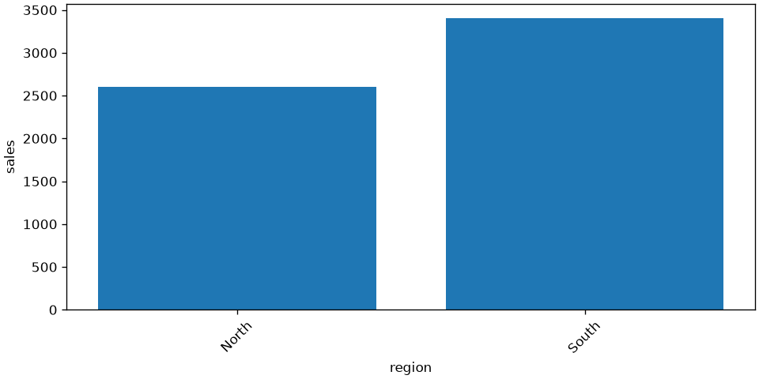

# pi-web walkthrough

[中文](README.zh-CN.md) | [English](README.en.md) · [Back to README](../../README.en.md)

Use the repository's fictional fixtures, not private files. Sections A/B do not
need a real model; sections C/D explicitly require a Provider or Docker. This is
a reproducible walkthrough and recording script, **not an already-recorded video**.

## Prepare

Install dependencies and build the frontend using the [quick start](../../README.en.md#quick-start).
Prefer a new demo-only data directory and unused port so real chats, credentials
and execution tasks never appear in the demonstration:

```powershell
$env:PYTHONPATH = "src"
$env:HOST = "127.0.0.1"
$env:PORT = "8135"
$env:EXTRA_UI_ORIGINS = "http://127.0.0.1:8135"
$env:PI_AGENT_DATA_DIR = Join-Path (Get-Location) ".test-tmp/pi-web-demo"
$env:PI_AGENT_SECRET_BACKEND = "memory"
$env:PI_LOCAL_DOCKER_ENABLED = "0"
python scripts/dev_web_app.py
```

For a custom port, set the matching `EXTRA_UI_ORIGINS`; otherwise login is rejected
by the Origin check. Run at the repository root. If that directory was used before, choose a fresh name;
do not clear it. Open `http://127.0.0.1:8135`. Close this terminal after the demo so
its settings are not reused for your normal service. Demo data is not automatically
deleted. Memory mode does not persist API keys. Start with `admin / 123456` and
change the password off-camera. Do not configure live Providers or external MCP
servers for the offline segments.

## A. Chat and isolated workspaces — about 2 minutes

1. Click **+ New chat** and name it `Demo: sales review`.
2. Drop [project-notes.md](../../examples/demo/project-notes.md) and
   [sales.csv](../../examples/demo/sales.csv) into chat or Workspace.
3. Confirm `upload/project-notes.md` and `upload/sales.csv` in the tree; preview the CSV.
4. Send `Hello, this is an offline UI demo.` and observe the streaming reply.
5. Refresh: the Session, messages and uploaded files should still be present.
6. Create another Session, confirm that the first Session's uploads and tool selection
   have not carried over, then switch back.

**Expected:** `Hello from delayed fake backend`. The simulated client does not
understand the files or autonomously invoke tools. This demonstrates UI behavior,
persistence and workspace isolation—not model reasoning.

## B. Real fixed analysis without an LLM — about 2 minutes

1. In that Workspace, open **extensions** → Tools and enable **Data Analysis** (`analyze_data`).
2. Switch to **analysis**, select `sales.csv`, and choose action `chart`.
3. Choose `bar`, set X to `region` and Y to `sales`, and run the operation. Bar charts sum Y by X.
4. Check the table and bar chart, then click **Save**.
5. Confirm results under `artifacts/analysis/<run-id>/` and reopen them after refresh.
6. Confirm the original `upload/sales.csv` is unchanged.

This is actual local worker computation; it does not execute arbitrary Python and
does not need an LLM or Docker.

| Fixture check | Expected |
| --- | ---: |
| Input rows | 6 |
| North sales | 2600 |
| South sales | 3400 |
| Total sales | 6000 |
| January / February, if grouped by month separately | 2700 / 3300 |

This chart was actually generated by the application's local analysis worker in
an isolated demo Workspace. It is not a mock UI or a model-generated illustration.



See the [demo validation record](VALIDATION.md) for executed and unexecuted segments.

## C. A real model, wiki proposals and Telemetry — about 3 minutes

This segment needs a real Provider and may incur fees. Use only synthetic inputs;
never record API keys.

1. Create and bind a real profile under Providers, then send:

   > Read this Workspace's project-notes.md. Separate confirmed requirements from open questions and cite the source for each item. Do not change files or execute code.

2. Open **Knowledge**, create a `Demo Studio` Space and upload
   [wiki-source.html](../../examples/demo/wiki-source.html). Single-file HTML parsing
   is local and does not require MinerU.
3. In the Space conversation, ask:

   > Draft a project entry page from the current source. Separate confirmed requirements from unresolved questions. Prepare a proposal and wait for my review before publishing.

4. Review the Change Set and its sources; approve only if correct. Inspect Pages
   and source relationships afterward.
5. Open admin **Telemetry** and inspect request status, latency, tokens and tools.
   Not storing message bodies in Telemetry does not mean no data reached the model Provider.

Do not claim the HTML demo validates PDF/OCR quality. MinerU profiles require an
independent Worker and hardware acceptance. CPU table extraction has known problems
and `runtime_ready=false` remains. Workspace image/video-link parsing is also not implemented.

## D. Optional execution approval — about 3 minutes

Only show this after an operator prepares and verifies a fixed Docker image using
the [Bash runtime guide](../../docker/bash-runtime/README.md), explicitly enables
it for the demo server, and opts in within the demo Workspace. Do not change the normal service.

Suggested prompt:

> In a managed copy of this Workspace, use Python's standard library to read upload/sales.csv and produce regional totals as JSON. Show the task scope and code first, and wait for approval. Do not use the network, install dependencies or modify originals. Ask separately before publishing results back.

Show: task/script approval → execution → frozen artifacts and diff → separate
publication approval → results in Workspace. You can first select **Deny** to
demonstrate withheld execution, then start a new approvable task. Never demonstrate
blanket automatic approval. Exit code 0 or output-integrity evidence is not proof
that the requested behavior was validated.

If you instead demonstrate `run_python_analysis`, identify it correctly: a local,
dependency-isolated Python environment with per-execution confirmation, **not a
Docker security sandbox**.

## Recording storyboard

| Time | View | English narration |
| --- | --- | --- |
| 00:00–00:20 | New chat | “pi-web is a local Web Agent. Every input in this demo is synthetic.” |
| 00:20–01:20 | Drop, preview, refresh | “Each Session owns a separate Workspace. Originals go under upload and survive refresh.” |
| 01:20–02:00 | Simulated streaming | “This is a fake Provider demonstrating streaming, not real-model intelligence.” |
| 02:00–03:30 | Analysis, chart, Save | “Actual local totals are North 2600 and South 3400. Saving results preserves the originals.” |
| 03:30–04:30 | Real-model proposal | “The model creates a proposal. Only approved pages enter the current wiki.” |
| 04:30–05:00 | Telemetry | “Admins inspect execution metadata without collecting message bodies in this dashboard.” |

Skip C/D and label them “not demonstrated” when prerequisites are missing. Never
substitute simulated footage for real acceptance. Check the address bar, downloads,
chat text and terminal for private paths or credentials before sharing a recording.

## Verification references

The fixture totals can be independently checked with Python's standard library.
Relevant browser regressions include [analysis](../../tests/e2e/data-analysis.spec.ts),
[Workspace](../../tests/e2e/workspace-results.spec.ts), and
[Telemetry](../../tests/e2e/telemetry-admin.spec.ts). These tests use a fake Provider.
See the [gate guide](../guides/local-gates.md) for the distinction between offline,
browser, Docker and MinerU evidence. A written walkthrough is not an acceptance result.
